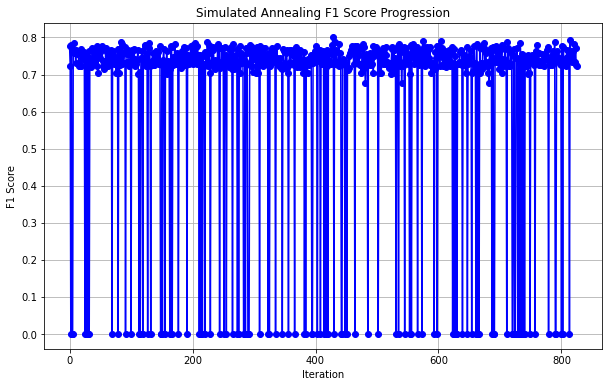
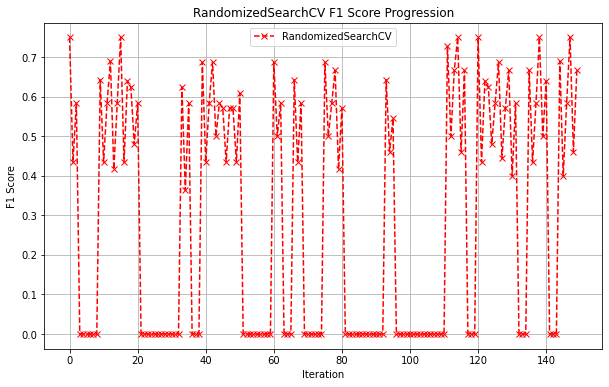
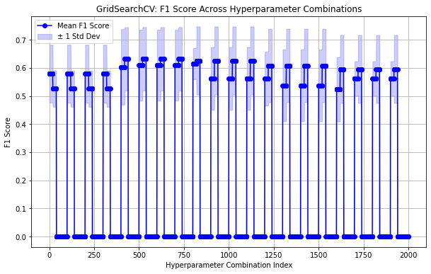

# Simulated Annealing and Hyperparameter Optimization

## Overview

This repository demonstrates the application of Simulated Annealing, Randomized Search, and Grid Search for hyperparameter optimization of a LightGBM model. The project uses the Diabetes dataset as an example and provides visualizations for the optimization process and performance comparison.

## Features

- Implementation of **Simulated Annealing** for hyperparameter optimization.
- Comparison of Simulated Annealing with **Randomized Search** and **Grid Search**.
- Visualization of F1 score progression for each optimization technique.
- Utilizes LightGBM for binary classification on the Diabetes dataset.

## Requirements

To run the code, you need the following dependencies:

- Python 3.7+
- `numpy`
- `pandas`
- `matplotlib`
- `scikit-learn`
- `lightgbm`

### Using Anaconda

1. Create a new environment and install the dependencies:
   ```bash
   conda create -n sa-optimization python=3.7 -y
   conda activate sa-optimization
   conda install numpy pandas matplotlib scikit-learn lightgbm -c conda-forge -y
   ```

2. Verify the dependencies are installed:
   ```bash
   conda list
   ```


## Usage

1. Clone the repository:

   ```bash
   git clone https://github.com/your-username/simulated-annealing-hyperparam-optimization.git
   cd simulated-annealing-hyperparam-optimization
   ```

2. Activate the conda environment:

   ```bash
   conda activate sa-optimization
   ```

3. Run the Python script:

   ```bash
   python main.py
   ```

4. The script will output:
   - The best hyperparameters and F1 score for Simulated Annealing.
   - The best hyperparameters and F1 scores for Randomized Search and Grid Search.
   - F1 score progression visualizations for all methods.

## Files

- **`main.py`**: Main script implementing the optimization methods.
- **`a.png`**: Visualization of F1 score progression using Simulated Annealing.
- **`b.png`**: Visualization of F1 score progression using Randomized Search.
- **`c.png`**: Visualization of F1 score progression using Grid Search.
- **`README.md`**: Documentation for the repository.

## Optimization Techniques

### 1. Simulated Annealing

An optimization technique inspired by the annealing process in metallurgy. This approach starts with a high "temperature" and gradually cools down, allowing for exploration of the parameter space and convergence to the optimal solution.

### 2. Randomized Search

A sampling-based hyperparameter optimization technique that randomly selects combinations of hyperparameters from a specified search space.

### 3. Grid Search

An exhaustive search technique that evaluates all possible combinations of hyperparameters in a grid-defined search space.

## Results

### Simulated Annealing F1 Score Progression


### Randomized Search F1 Score Progression


### Grid Search F1 Score Progression


## Contribution

Feel free to contribute by:

- Adding new optimization techniques.
- Improving the code and documentation.

Fork the repository and make a pull request with your changes.

---

### Author

Md. Shakibuzzaman
